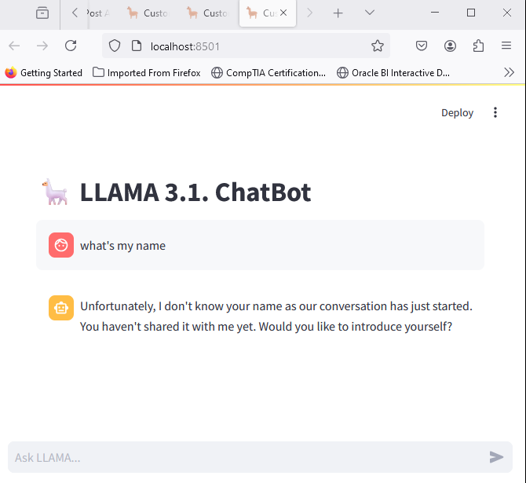

The project integrates Groq’s API to leverage the power of the LLAMA 3.1 model. The API key is securely handled and stored in the environment variables, ensuring safe and easy access during runtime.

Streamlit Configuration:

The Streamlit library is utilized for building the chatbot's user interface. The page is configured with a custom title and an engaging llama icon 🦙, setting the tone for the chat experience.

User Interaction:

The chatbot interface is designed for seamless user interaction. Users can input their questions or prompts, which are then processed by the LLAMA model to generate thoughtful and relevant responses.

LLAMA 3.1 Response Handling:

User messages are sent to the LLAMA 3.1 model, which is programmed as a helpful assistant. The model processes the conversation history and generates a response, ensuring a natural and engaging dialogue.

groq==0.9.0
streamlit==1.37.0

Gemini, claude. Gpt are equivalent to LLAMA
Equivalent for UI is Stremlit, Chainlit. These are free source
Paid version are reactjs, nodejs, java script

activate your environment:
python -m venv venv
cd venv/Scripts
activate
cd ../..

python -m pip install --upgrade pip   # install upgrate package for python

pip install -r requirements.txt    # install the dependencies of pip

import os

streamlit run main.py

